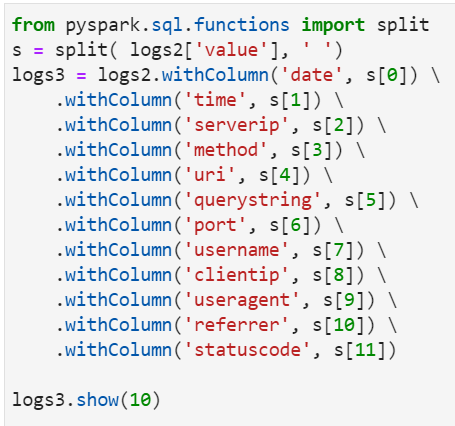

# IST769 Lab D
## Object Storage and Spark

In this lab, we will explore the power of Apache Spark for ad-hoc data analytics over semi-structured data. We will analyze website log files where one row in the log represents a resource loaded from the web server. We will combine this data with geographic data based on IP Address so that we can determine the origins of the users visiting our website.

## Outcomes

At the end of this lab you should be able to:

- Manage data in object storage like AWS S3, or Minio
- Use Apache Spark to perform extract, transform and load of semi-structured data
- Use Apache Spark SQL to perform a basic analysis of the data.


## Setup

1. Open the terminal window in your `ist769` folder.
1. Change the current working directory to `docker/spark`:  
`ist769$ cd docker/spark`
1. Bring up the Spark / Minio environment:  
`spark$ docker-compose up -d`
1. Make sure the 3 containers in this setup are running. `jupyter`, `minio` and `minio-client`:  
`spark$ docker-compose ps`
1. Get the URL with access token for jupyter. It will be a url in the jupyter logs:  
`spark$ docker-compose logs jupyter`

### Connecting to services in the lab

1. To connect to JupyterLab, open the jupyter URL with access token.   
IMPORTANT: Save your work to the `work` folder and it will persist between sessions.
2. To connect to minio client, open a shell in that container:  
`ist769$ docker-compose exec minio-client bash`
3. To connect to the minio web console, open a browser at http://localhost:9000 and login as user `minio` with password `SU2orange!`

## Exercises

In this section we will use spark to transform raw website log data into a useable format for data analysis. We will first load and clean the logs, then load the ip lookup geographic data, then combine the two into a single output. Finally we wil use SQL to answer some basic questions about the data.

NOTE: When you are working in JupyterLab, its good practice to place each question in its own cell.


Q1. Connect to the minio client. Create an alias to your minio server, named `ms`. Create a bucket `labd`. Inside the bucket, create folders `iplookup` and `logs`. Copy the 3 log files from `/data/clickstream` to the minio `logs` folder. Copy `iplookup.json` to the `iplookup` folder.  
When you are finished you should have the following structure. Provide a list of commands necessary to complete this task.

```
ms
|
|__ labd
    |
    |__ iplookup
    |  |
    |  |__ iplookup.json
    |
    |__logs
       |
       |__ u_ex160211.log, u_ex160212.log, u_ex160213.log
```

Q2. From Jupyterlab, create a new JupyterLab Spark notebook called `labd.ipynb`  in your `work` folder. Add this information to a code cell to configure access to minio.
```
import pyspark
from pyspark.sql import SparkSession
ENDPOINT='http://minio:9000'
AWS_ID="minio"
AWS_KEY="SU2orange!"
spark = SparkSession.builder \
    .master("local") \
    .appName('jupyter-pyspark') \
    .config("spark.hadoop.fs.s3a.endpoint", ENDPOINT) \
    .config("spark.hadoop.fs.s3a.access.key", AWS_ID) \
    .config("spark.hadoop.fs.s3a.secret.key", AWS_KEY) \
    .config("spark.hadoop.fs.s3a.fast.upload", True) \
    .config("spark.hadoop.fs.s3a.path.style.access", True) \
    .config("spark.hadoop.fs.s3a.impl", "org.apache.hadoop.fs.s3a.S3AFileSystem") \
    .getOrCreate()
sc = spark.sparkContext
sc.setLogLevel("ERROR")
```

Q3. Write Spark code to load logs from `labd/logs` from minio into a dataframe `logs1` using `spark.read.text`. print the schema, and show 10 rows from the datafame. Your output should look like this:  
```
root
 |-- value: string (nullable = true)

+--------------------+
|               value|
+--------------------+
|#Software: Micros...|
|       #Version: 1.0|
|#Date: 2016-02-11...|
|#Fields: date tim...|
|2016-02-11 17:16:...|
|2016-02-11 17:16:...|
|2016-02-11 17:16:...|
|2016-02-11 17:16:...|
|2016-02-11 17:16:...|
|2016-02-11 17:16:...|
+--------------------+
only showing top 10 rows
```

Q4: We need to remove the rows with `#` in front of them, as these are commments in the web server log files. Use the `filter` function to do this, and save the results into dataframe `logs2`. The filter expression should be `~raw1["value"].startswith("#")` which says, rows should not start with a `#`. Your first 10 rows should look like this:  
```
+--------------------+
|               value|
+--------------------+
|2016-02-11 17:16:...|
|2016-02-11 17:16:...|
|2016-02-11 17:16:...|
|2016-02-11 17:16:...|
|2016-02-11 17:16:...|
|2016-02-11 17:16:...|
|2016-02-11 17:16:...|
|2016-02-11 17:16:...|
|2016-02-11 17:16:...|
|2016-02-11 17:16:...|
+--------------------+
only showing top 10 rows
```

Q5: At this point each row in the log contains multiple values, separated by a space. we must split these into separate columns. To do that we must import the `split` function then apply each split to a new column. Code is provided but you must type it in and run it, saving the change into the `logs3` dataframe.



Q6: Transform `logs3` removing the first column `value` but keeping all the others, save this as `logs4`.
```
+----------+--------+--------------+------+--------------------+-----------+----+--------+-----------+--------------------+--------------------+----------+
|      date|    time|      serverip|method|                 uri|querystring|port|username|   clientip|           useragent|            referrer|statuscode|
+----------+--------+--------------+------+--------------------+-----------+----+--------+-----------+--------------------+--------------------+----------+
|2016-02-11|17:16:13|128.230.247.37|   GET|                   /|          -|  80|       -|215.82.23.2|Mozilla/5.0+(Wind...|                   -|       200|
|2016-02-11|17:16:13|128.230.247.37|   GET|/Content/jquery-u...|          -|  80|       -|215.82.23.2|Mozilla/5.0+(Wind...|http://group0.ist...|       200|
|2016-02-11|17:16:13|128.230.247.37|   GET|/Plugins/Widgets....|          -|  80|       -|215.82.23.2|Mozilla/5.0+(Wind...|http://group0.ist...|       200|
|2016-02-11|17:16:13|128.230.247.37|   GET|/Plugins/Widgets....|          -|  80|       -|215.82.23.2|Mozilla/5.0+(Wind...|http://group0.ist...|       200|
|2016-02-11|17:16:13|128.230.247.37|   GET|/Scripts/jquery.v...|          -|  80|       -|215.82.23.2|Mozilla/5.0+(Wind...|http://group0.ist...|       200|
|2016-02-11|17:16:13|128.230.247.37|   GET|/Scripts/jquery.v...|          -|  80|       -|215.82.23.2|Mozilla/5.0+(Wind...|http://group0.ist...|       200|
|2016-02-11|17:16:13|128.230.247.37|   GET|/Themes/DefaultCl...|          -|  80|       -|215.82.23.2|Mozilla/5.0+(Wind...|http://group0.ist...|       200|
|2016-02-11|17:16:13|128.230.247.37|   GET|/Scripts/jquery-m...|          -|  80|       -|215.82.23.2|Mozilla/5.0+(Wind...|http://group0.ist...|       200|
|2016-02-11|17:16:13|128.230.247.37|   GET|/Scripts/public.c...|          -|  80|       -|215.82.23.2|Mozilla/5.0+(Wind...|http://group0.ist...|       200|
|2016-02-11|17:16:13|128.230.247.37|   GET|/Scripts/public.a...|          -|  80|       -|215.82.23.2|Mozilla/5.0+(Wind...|http://group0.ist...|       200|
|2016-02-11|17:16:13|128.230.247.37|   GET|/Plugins/Widgets....|          -|  80|       -|215.82.23.2|Mozilla/5.0+(Wind...|http://group0.ist...|       200|
|2016-02-11|17:16:13|128.230.247.37|   GET|/Scripts/jquery-u...|          -|  80|       -|215.82.23.2|Mozilla/5.0+(Wind...|http://group0.ist...|       200|
|2016-02-11|17:16:13|128.230.247.37|   GET|/Scripts/jquery-1...|          -|  80|       -|215.82.23.2|Mozilla/5.0+(Wind...|http://group0.ist...|       200|
|2016-02-11|17:16:13|128.230.247.37|   GET|/content/images/t...|          -|  80|       -|215.82.23.2|Mozilla/5.0+(Wind...|http://group0.ist...|       200|
|2016-02-11|17:16:13|128.230.247.37|   GET|/Themes/DefaultCl...|          -|  80|       -|215.82.23.2|Mozilla/5.0+(Wind...|http://group0.ist...|       200|
|2016-02-11|17:16:13|128.230.247.37|   GET|/content/images/t...|          -|  80|       -|215.82.23.2|Mozilla/5.0+(Wind...|http://group0.ist...|       200|
|2016-02-11|17:16:13|128.230.247.37|   GET|/content/images/t...|          -|  80|       -|215.82.23.2|Mozilla/5.0+(Wind...|http://group0.ist...|       200|
|2016-02-11|17:16:13|128.230.247.37|   GET|/content/images/t...|          -|  80|       -|215.82.23.2|Mozilla/5.0+(Wind...|http://group0.ist...|       200|
|2016-02-11|17:16:13|128.230.247.37|   GET|/content/images/t...|          -|  80|       -|215.82.23.2|Mozilla/5.0+(Wind...|http://group0.ist...|       200|
|2016-02-11|17:16:13|128.230.247.37|   GET|/content/images/t...|          -|  80|       -|215.82.23.2|Mozilla/5.0+(Wind...|http://group0.ist...|       200|
+----------+--------+--------------+------+--------------------+-----------+----+--------+-----------+--------------------+--------------------+----------+
only showing top 20 rows
```


Q7: We are finished tabluarizing the log data, so now  let's handle the IP Address lookup data. Write spark to load the `iplookup.json` file from Minio into the data frame `ips1`. Show the first 10 rows and print the schema. 
```
+--------------------+---------------+--------------------+
|           geography|             ip|            location|
+--------------------+---------------+--------------------+
|   {Dulles, USA, VA}|  172.189.252.8|{38.955855, -77.4...|
| {Columbus, USA, OH}|    215.82.23.2|{39.961176, -82.9...|
|{Cleveland, USA, OH}|    98.29.25.44|{41.49932, -81.69...|
| {Freeport, USA, NY}|  68.199.40.156|{40.657602, -73.5...|
|{Salt Lake City, ...|155.100.169.152|{40.760779, -111....|
|   {Dallas, USA, TX}|   38.68.15.223|{32.776664, -96.7...|
|    {Tampa, USA, FL}|   70.209.14.54|{27.950575, -82.4...|
|{Arlington, USA, VA}|   74.111.6.173|{38.87997, -77.10...|
| {Syracuse, USA, NY}|128.230.122.180|{43.048122, -76.1...|
| {New York, USA, NY}|128.122.140.238|{40.712784, -74.0...|
+--------------------+---------------+--------------------+
only showing top 10 rows

root
 |-- geography: struct (nullable = true)
 |    |-- city: string (nullable = true)
 |    |-- country: string (nullable = true)
 |    |-- state: string (nullable = true)
 |-- ip: string (nullable = true)
 |-- location: struct (nullable = true)
 |    |-- lat: double (nullable = true)
 |    |-- lng: double (nullable = true)
```

Q8: We need to flatten the nested JSON data, use the `select()` function with dot notation to do this. Here are the first 10 rows of the desired results, saved in a dataframe named `ips2`:
```
+---------------+-------+--------------+-----+---------+-----------+
|             ip|country|          city|state|      lat|        lng|
+---------------+-------+--------------+-----+---------+-----------+
|  172.189.252.8|    USA|        Dulles|   VA|38.955855| -77.447819|
|    215.82.23.2|    USA|      Columbus|   OH|39.961176| -82.998794|
|    98.29.25.44|    USA|     Cleveland|   OH| 41.49932| -81.694361|
|  68.199.40.156|    USA|      Freeport|   NY|40.657602| -73.583184|
|155.100.169.152|    USA|Salt Lake City|   UT|40.760779|-111.891047|
|   38.68.15.223|    USA|        Dallas|   TX|32.776664| -96.796988|
|   70.209.14.54|    USA|         Tampa|   FL|27.950575| -82.457178|
|   74.111.6.173|    USA|     Arlington|   VA| 38.87997|  -77.10677|
|128.230.122.180|    USA|      Syracuse|   NY|43.048122| -76.147424|
|128.122.140.238|    USA|      New York|   NY|40.712784| -74.005941|
+---------------+-------+--------------+-----+---------+-----------+
only showing top 10 rows
```

Q9: Time to join the two dataframes together into a new dataframe `comb1`. Use the `join()` function to do this, creating an `"inner"` join mathing `logs4.clientip==ips2.ip`. Here are the top 10 rows:
```
+----------+--------+--------------+------+--------------------+-----------+----+--------+-----------+--------------------+--------------------+----------+-----------+-------+--------+-----+---------+----------+
|      date|    time|      serverip|method|                 uri|querystring|port|username|   clientip|           useragent|            referrer|statuscode|         ip|country|    city|state|      lat|       lng|
+----------+--------+--------------+------+--------------------+-----------+----+--------+-----------+--------------------+--------------------+----------+-----------+-------+--------+-----+---------+----------+
|2016-02-11|17:16:13|128.230.247.37|   GET|                   /|          -|  80|       -|215.82.23.2|Mozilla/5.0+(Wind...|                   -|       200|215.82.23.2|    USA|Columbus|   OH|39.961176|-82.998794|
|2016-02-11|17:16:13|128.230.247.37|   GET|/Content/jquery-u...|          -|  80|       -|215.82.23.2|Mozilla/5.0+(Wind...|http://group0.ist...|       200|215.82.23.2|    USA|Columbus|   OH|39.961176|-82.998794|
|2016-02-11|17:16:13|128.230.247.37|   GET|/Plugins/Widgets....|          -|  80|       -|215.82.23.2|Mozilla/5.0+(Wind...|http://group0.ist...|       200|215.82.23.2|    USA|Columbus|   OH|39.961176|-82.998794|
|2016-02-11|17:16:13|128.230.247.37|   GET|/Plugins/Widgets....|          -|  80|       -|215.82.23.2|Mozilla/5.0+(Wind...|http://group0.ist...|       200|215.82.23.2|    USA|Columbus|   OH|39.961176|-82.998794|
|2016-02-11|17:16:13|128.230.247.37|   GET|/Scripts/jquery.v...|          -|  80|       -|215.82.23.2|Mozilla/5.0+(Wind...|http://group0.ist...|       200|215.82.23.2|    USA|Columbus|   OH|39.961176|-82.998794|
|2016-02-11|17:16:13|128.230.247.37|   GET|/Scripts/jquery.v...|          -|  80|       -|215.82.23.2|Mozilla/5.0+(Wind...|http://group0.ist...|       200|215.82.23.2|    USA|Columbus|   OH|39.961176|-82.998794|
|2016-02-11|17:16:13|128.230.247.37|   GET|/Themes/DefaultCl...|          -|  80|       -|215.82.23.2|Mozilla/5.0+(Wind...|http://group0.ist...|       200|215.82.23.2|    USA|Columbus|   OH|39.961176|-82.998794|
|2016-02-11|17:16:13|128.230.247.37|   GET|/Scripts/jquery-m...|          -|  80|       -|215.82.23.2|Mozilla/5.0+(Wind...|http://group0.ist...|       200|215.82.23.2|    USA|Columbus|   OH|39.961176|-82.998794|
|2016-02-11|17:16:13|128.230.247.37|   GET|/Scripts/public.c...|          -|  80|       -|215.82.23.2|Mozilla/5.0+(Wind...|http://group0.ist...|       200|215.82.23.2|    USA|Columbus|   OH|39.961176|-82.998794|
|2016-02-11|17:16:13|128.230.247.37|   GET|/Scripts/public.a...|          -|  80|       -|215.82.23.2|Mozilla/5.0+(Wind...|http://group0.ist...|       200|215.82.23.2|    USA|Columbus|   OH|39.961176|-82.998794|
+----------+--------+--------------+------+--------------------+-----------+----+--------+-----------+--------------------+--------------------+----------+-----------+-------+--------+-----+---------+----------+
only showing top 10 rows
```

Q10: Register the `comb1` dataframe as a Temp SQL View named `loganalysis`. Save the transformed data back to Minio as 'labd/cleaned-logs.json` in JSON format. Make sure to use `mode="overwrite"` in case you need to run it more than once.

Q11: Let's use `spark.sql` and our table `logfileanalysis` to write some SQL statements. First let's check for errors. provide a count of requests grouped by status code. Are there any errors? If you are not familiar with HTTP status codes, check here: https://developer.mozilla.org/en-US/docs/Web/HTTP/Status 

```
+----------+---------------+
|statuscode|statuscodecount|
+----------+---------------+
|       200|           1098|
|       ...|           ... |
|       ...|           ... |
+----------+---------------+
(sample output... some values omitted)
```

Q12: Where do our visitors come from? Write a query to count HTTP requests by city and state. sort by state then city. Which City has the most requests? The least?
```
+-----+--------------+-----+
|state|          city|count|
+-----+--------------+-----+
|   CA|   Los Angeles|   24|
|   FL|         Tampa|   54|
|   ..|           ...|   ..|
+-----+--------------+-----+
(sample output... some values omitted)
```

